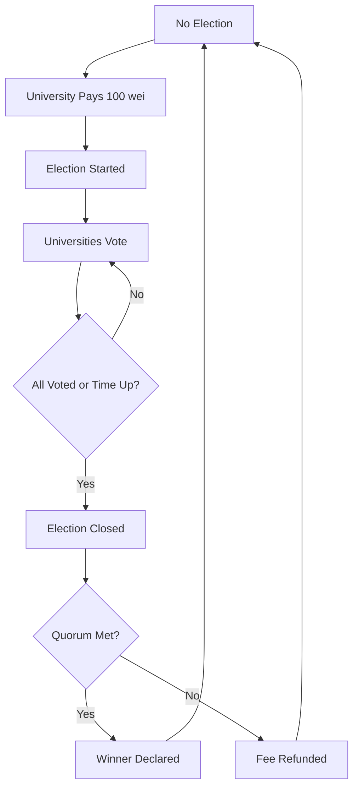

# 🗳️ On-Chain Safe Election

🎓 A decentralized application (DApp) for managing university elections and professor enrollment built on Ethereum blockchain. This system enables universities to participate in transparent, secure elections while managing professor enrollments with smart contract-enforced rules.

⚡ Built on **Scaffold-ETH 2** framework using Next.js, RainbowKit, Hardhat, Wagmi, Viem, and TypeScript.

## 🌟 Features

### 🏛️ University Management
- **University Registration**: Three pre-registered universities with hardcoded addresses
- **Professor Enrollment**: Universities can enroll professors with a 10 wei fee
- **Capacity Management**: Maximum 30 professors per university
- **Fee Distribution**: Enrollment fees are automatically transferred to universities

### 🗳️ Election System
- **Election Lifecycle**: Universities can start elections with a 100 wei fee
- **Voting Mechanism**: Encrypted voting system with JSON-based vote structure
- **Election Status**: Three states - NO_ELECTION, IN_PROGRESS, CLOSED
- **Time-based Elections**: Elections run for 1000 blocks (configurable)
- **Quorum Requirements**: Requires majority participation for valid elections

### 🔐 Security & Transparency
- **Smart Contract Enforcement**: All rules enforced at blockchain level
- **Transparent Voting**: Immutable vote records on blockchain
- **Access Control**: Only registered universities can participate
- **Fee Management**: Automatic fee handling and refunds

### 🛠️ Development Tools
- **Contract Hot Reload**: Frontend auto-adapts to smart contract changes
- **Custom Hooks**: TypeScript-enabled React hooks for contract interactions
- **Debug Interface**: Built-in contract debugging and testing tools
- **Block Explorer**: Integrated blockchain explorer for transaction tracking

## 🏗️ Architecture

### Smart Contract Structure
```
YourContract.sol
├── University Management
│   ├── universityProfessors (mapping)
│   ├── isUniversity (mapping)
│   └── professorToUniversity (mapping)
├── Election System
│   ├── votesMap (mapping)
│   ├── hasVoted (mapping)
│   └── VOTE_STATUS (enum)
└── Fee Management
    ├── ENROLLMENT_FEE (10 wei)
    └── ELECTION_START_FEE (100 wei)
```

### Frontend Architecture
```
packages/nextjs/
├── app/
│   ├── page.tsx (Main voting interface)
│   ├── debug/ (Contract debugging tools)
│   └── blockexplorer/ (Blockchain explorer)
├── components/scaffold-eth/ (Reusable Web3 components)
├── hooks/scaffold-eth/ (Custom contract interaction hooks)
└── contracts/ (Auto-generated contract interfaces)
```

## 🚀 Getting Started

### Prerequisites
- [Node.js (>= v18.18)](https://nodejs.org/en/download/)
- [Yarn](https://classic.yarnpkg.com/en/docs/install/) (v1 or v2+)
- [Git](https://git-scm.com/downloads)
- MetaMask or compatible Web3 wallet

### Installation

1. **Clone the repository**
   ```bash
   git clone https://github.com/your-username/university-election-dapp.git
   cd university-election-dapp
   ```

2. **Install dependencies**
   ```bash
   yarn install
   ```

3. **Start local blockchain**
   ```bash
   yarn chain
   ```
   This starts a local Hardhat network with pre-configured accounts.

4. **Deploy smart contracts**
   ```bash
   yarn deploy
   ```
   Deploys the YourContract.sol to the local network with three hardcoded universities.

5. **Launch the application**
   ```bash
   yarn start
   ```
   Access the DApp at `http://localhost:3000`

### Pre-configured Universities
The system comes with three hardcoded university addresses:
- University 1: `0x904362203af32398c5F50E1Ac9C9F1e164888cE9`
- University 2: `0xA4dB1a53a8b538462F66dEAed1B73375357F602a`
- University 3: `0x481709C180f3B285618ddfdBCf51ecc3Be6999eB`

Each starts with 10 enrolled professors and can accommodate up to 30.

## 📖 Usage

### For Universities

#### Starting an Election
1. Connect wallet using one of the pre-configured university addresses
2. Ensure election status is "NO_ELECTION"
3. Click "Start Votation" button
4. Pay 100 wei election fee
5. Election runs for 1000 blocks

#### Voting Process
1. During election (IN_PROGRESS status)
2. Enter vote data in JSON format: `{"candidate_name": vote_count}`
3. Example: `{"Alice": 50, "Bob": 30, "scheda bianca": 0}`
4. Submit encrypted vote (one vote per university)

#### Professor Management
1. **Enrollment**: Pay 10 wei to enroll professors
2. **Capacity**: Maximum 30 professors per university
3. **Unenrollment**: Remove professors when no election is active

### For Developers

#### Testing Contracts
```bash
yarn hardhat:test
```

#### Contract Debugging
1. Navigate to `/debug` page
2. Interact with contract functions directly
3. View contract state and events
4. Test different scenarios

#### Linting & Type Checking
```bash
yarn hardhat:lint
yarn next:lint
yarn next:check-types
```

## 🔧 Configuration

### Network Configuration
Edit `packages/hardhat/hardhat.config.ts` to modify network settings.

### Frontend Configuration
Customize `packages/nextjs/scaffold.config.ts` for:
- Target networks
- Polling intervals
- API keys
- Wallet configurations

### Contract Parameters
Modify these values in the constructor:
- `CAP`: Maximum professors per university (default: 30)
- `ENROLLMENT_FEE`: Professor enrollment fee (default: 10 wei)
- `ELECTION_START_FEE`: Election start fee (default: 100 wei)
- `electionDurationInBlocks`: Election duration (default: 1000 blocks)

## 🔒 Security Features

### Access Control
- **University Verification**: Only pre-registered universities can participate
- **Election State Checks**: Actions restricted based on election status
- **Professor Association**: Professors can only be enrolled in one university

### Fee Management
- **Automatic Transfers**: Fees automatically sent to universities
- **Refund Mechanism**: Election fees refunded if quorum not met
- **Value Validation**: Minimum fee requirements enforced

### Vote Integrity
- **One Vote Per University**: Universities cannot vote multiple times
- **Encrypted Votes**: Vote data is encrypted before storage
- **Immutable Records**: Votes stored permanently on blockchain

## 🛠️ Development

### Project Structure
```
├── packages/
│   ├── hardhat/          # Smart contract development
│   │   ├── contracts/    # Solidity contracts
│   │   ├── deploy/       # Deployment scripts
│   │   └── test/         # Contract tests
│   └── nextjs/           # Frontend application
│       ├── app/          # Next.js app router
│       ├── components/   # React components
│       ├── hooks/        # Custom React hooks
│       └── utils/        # Utility functions
```

### Smart Contract Events
The contract emits several events for frontend integration:
- `ElectionStarted`: When an election begins
- `UniversityVoted`: When a university submits a vote
- `ProfessorEnrolled`: When a professor enrolls
- `ProfessorRemoved`: When a professor is removed
- `StatusChanged`: When election status changes
- `FeeReceived`: When fees are paid

### Custom Hooks
- `useScaffoldReadContract`: Read contract state
- `useScaffoldWriteContract`: Execute contract functions
- `useDeployedContractInfo`: Get contract deployment info
- `useTargetNetwork`: Manage network connections

## 📊 Election Workflow



## 🤝 Contributing

We welcome contributions! Please see our [Contributing Guidelines](CONTRIBUTING.md) for details.

### Development Workflow
1. Fork the repository
2. Create a feature branch
3. Make your changes
4. Add tests if applicable
5. Submit a pull request

### Reporting Issues
- Use GitHub Issues for bug reports
- Provide detailed reproduction steps
- Include relevant logs and screenshots

## 📄 License

This project is licensed under the MIT License - see the [LICENSE](LICENSE) file for details.

## 🔗 Resources

- [Scaffold-ETH 2 Documentation](https://docs.scaffoldeth.io)
- [Hardhat Documentation](https://hardhat.org/docs)
- [Next.js Documentation](https://nextjs.org/docs)
- [Wagmi Documentation](https://wagmi.sh/)
- [RainbowKit Documentation](https://www.rainbowkit.com/)

## 📞 Support

- Documentation: [docs.scaffoldeth.io](https://docs.scaffoldeth.io)
- GitHub Issues: For bug reports and feature requests
- Community: Join the Scaffold-ETH community discussions

---

Built with ❤️ using Scaffold-ETH 2