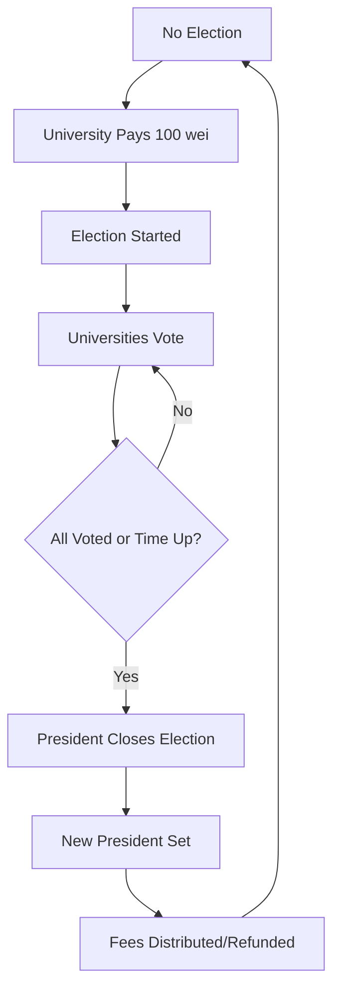

# On-Chain Election Integrity

🎓 A decentralized application (DApp) for managing university elections and professor enrollment built on Ethereum blockchain. This system enables universities to participate in transparent, secure elections while managing professor enrollments with smart contract-enforced rules.

⚡ Built on **Scaffold-ETH 2** framework using Next.js, RainbowKit, Hardhat, Wagmi, Viem, and TypeScript.

## 🌟 Features

### 🏛️ University Management
- **Dynamic University Registration**: President can add/remove universities (not hardcoded)
- **Professor Enrollment**: Universities can enroll professors with a 10 wei fee
- **Capacity Management**: Maximum 30 professors per university
- **Fee Distribution**: Enrollment fees are automatically transferred to universities

### 🗳️ Election System
- **Election Lifecycle**: Universities can start elections with a 100 wei fee
- **Voting Mechanism**: Encrypted voting system with JSON-based vote structure
- **Election Status**: Three states - NO_ELECTION, IN_PROGRESS, CLOSED
- **Time-based Elections**: Elections run for 1000 blocks (configurable)
- **Quorum Requirements**: Requires majority participation for valid elections

### 🔐 Security & Transparency
- **Smart Contract Enforcement**: All rules enforced at blockchain level
- **Transparent Voting**: Immutable vote records on blockchain
- **Access Control**: Only registered universities can participate
- **Fee Management**: Automatic fee handling and refunds

### 🛠️ Development Tools
- **Contract Hot Reload**: Frontend auto-adapts to smart contract changes
- **Custom Hooks**: TypeScript-enabled React hooks for contract interactions
- **Debug Interface**: Built-in contract debugging and testing tools
- **Block Explorer**: Integrated blockchain explorer for transaction tracking

## 🏗️ Architecture

### Smart Contract Structure
```
YourContract.sol
├── University Management
│   ├── universityProfessors (mapping)
│   ├── isUniversity (mapping)
│   ├── universityNames (mapping)
│   └── professorToUniversity (mapping)
├── Election System
│   ├── votesMap (mapping)
│   ├── hasVoted (mapping)
│   ├── VOTE_STATUS (enum)
│   └── electionEndBlock
├── Fee Management
│   ├── ENROLLMENT_FEE (10 wei)
│   ├── ELECTION_START_FEE (100 wei)
│   ├── feeHoldingAddress
│   └── heldFee
└── Governance
    ├── currentPresident
    └── President-only functions
```

### Frontend Architecture
```
packages/nextjs/
├── app/
│   ├── page.tsx (Main voting interface)
│   ├── debug/ (Contract debugging tools)
│   └── blockexplorer/ (Blockchain explorer)
├── components/scaffold-eth/ (Reusable Web3 components)
├── hooks/scaffold-eth/ (Custom contract interaction hooks)
└── contracts/ (Auto-generated contract interfaces)
```

## 🚀 Getting Started

### Prerequisites
- [Node.js (>= v20.18.3)](https://nodejs.org/en/download/)
- [Yarn](https://classic.yarnpkg.com/en/docs/install/) (v1 or v2+)
- [Git](https://git-scm.com/downloads)
- MetaMask or compatible Web3 wallet

### Installation

1. **Clone the repository**
   ```bash
   git clone https://github.com/your-username/university-election-dapp.git
   cd university-election-dapp
   ```

2. **Install dependencies**
   ```bash
   yarn install
   ```

3. **Start local blockchain**
   ```bash
   yarn chain
   ```
   This starts a local Hardhat network with pre-configured accounts.

4. **Deploy smart contracts**
   ```bash
   yarn deploy
   ```
   Deploys the YourContract.sol to the local network. Universities need to be added by the president after deployment.

5. **Launch the application**
   ```bash
   yarn start
   ```
   Access the DApp at `http://localhost:3000`

### Initial Setup
After deployment, the contract deployer becomes the initial president. Universities must be added manually by the president.

## 📖 Usage

### For the President

#### Managing Universities
1. **Add University**: Call `addUniversity(address, name)` when no election is active
2. **Remove University**: Call `removeUniversity(address)` when no election is active
3. **View All Universities**: Use `getAllUniversitiesWithNames()` to see registered universities

### For Universities

#### Starting an Election
1. Connect wallet using a registered university address
2. Ensure election status is "NO_ELECTION"
3. Call `startVotation()` function
4. Pay 100 wei election fee
5. Election runs for 1000 blocks

#### Voting Process
1. During election (IN_PROGRESS status)
2. Enter vote data in JSON format: `{"candidate_name": vote_count}`
3. Example: `{"Alice": 50, "Bob": 30, "scheda bianca": 0}`
4. Call `vote(voteData)` function (one vote per university)

#### Professor Management
1. **Enrollment**: Call `enrollProfessor(universityAddress)` and pay 10 wei
2. **Capacity**: Maximum 30 professors per university
3. **Unenrollment**: Call `removeProfessor()` when no election is active

### For Professors

#### Checking Status
- Use `getProfessorInfo(address)` to check enrollment status
- Professors can only be enrolled in one university at a time

### For Developers

#### Testing Contracts
```bash
yarn hardhat:test
```

#### Contract Debugging
1. Navigate to `/debug` page
2. Interact with contract functions directly
3. View contract state and events
4. Test different scenarios

#### Linting & Type Checking
```bash
yarn hardhat:lint
yarn next:lint
yarn next:check-types
```

## 🔧 Configuration

### Network Configuration
Edit `packages/hardhat/hardhat.config.ts` to modify network settings.

### Frontend Configuration
Customize `packages/nextjs/scaffold.config.ts` for:
- Target networks
- Polling intervals
- API keys
- Wallet configurations

### Contract Parameters
These constants are defined in the contract:
- `CAP`: Maximum professors per university (30)
- `ENROLLMENT_FEE`: Professor enrollment fee (10 wei)
- `ELECTION_START_FEE`: Election start fee (100 wei)
- `ELECTION_DURATION_BLOCKS`: Election duration (1000 blocks)
- `QUORUM_PERCENTAGE`: Quorum requirement (50%)

## 🔒 Security Features

### Access Control
- **President-Only Functions**: Adding/removing universities, closing elections
- **University Verification**: Only registered universities can participate
- **Election State Checks**: Actions restricted based on election status
- **Professor Association**: Professors can only be enrolled in one university

### Fee Management
- **Automatic Transfers**: Fees automatically sent to universities
- **Fee Holding**: Election fees held during voting process
- **Refund Mechanism**: Unused fees can be returned
- **Value Validation**: Minimum fee requirements enforced

### Vote Integrity
- **One Vote Per University**: Universities cannot vote multiple times
- **Vote Encryption**: Vote data stored as encrypted JSON strings
- **Immutable Records**: Votes stored permanently on blockchain
- **Election Lifecycle**: Proper state transitions enforced

## 🛠️ Development

### Project Structure
```
├── packages/
│   ├── hardhat/          # Smart contract development
│   │   ├── contracts/    # Solidity contracts
│   │   ├── deploy/       # Deployment scripts
│   │   ├── scripts/      # Utility scripts
│   │   └── test/         # Contract tests
│   └── nextjs/           # Frontend application
│       ├── app/          # Next.js app router
│       ├── components/   # React components
│       ├── hooks/        # Custom React hooks
│       ├── contracts/    # Contract interfaces
│       └── utils/        # Utility functions
```

### Smart Contract Events
The contract emits several events for frontend integration:
- `ElectionStarted`: When an election begins
- `ElectionClosed`: When an election ends
- `UniversityVoted`: When a university submits a vote
- `UniversityAdded`: When a university is registered
- `UniversityRemoved`: When a university is removed
- `ProfessorEnrolled`: When a professor enrolls
- `ProfessorRemoved`: When a professor is removed
- `PresidentChanged`: When presidency changes
- `StatusChanged`: When election status changes
- `FeeReceived`: When fees are paid
- `FeeReturned`: When fees are refunded

### Custom Hooks
- `useScaffoldReadContract`: Read contract state
- `useScaffoldWriteContract`: Execute contract functions
- `useScaffoldEventHistory`: Listen to contract events
- `useDeployedContractInfo`: Get contract deployment info
- `useTargetNetwork`: Manage network connections

### Key Contract Functions

#### View Functions
- `getAllUniversities()`: Get all university addresses
- `getAllUniversitiesWithNames()`: Get universities with names
- `getElectionInfo()`: Get current election status and info
- `getUniversityInfo(address)`: Get university details
- `getProfessorInfo(address)`: Check professor enrollment
- `isCurrentPresident(address)`: Check if address is president
- `getHeldFeeInfo()`: Get fee holding information
- `getCurrentBlock()`: Get current block number

#### State-Changing Functions
- `addUniversity(address, name)`: Add new university (president only)
- `removeUniversity(address)`: Remove university (president only)
- `startVotation()`: Start new election (payable, 100 wei)
- `vote(string)`: Submit vote during election
- `close(string)`: Close election and set winner (president only)
- `enrollProfessor(address)`: Enroll professor (payable, 10 wei)
- `removeProfessor()`: Remove professor from university
- `checkStatus()`: Update election status if time expired

## 📊 Election Workflow



## 🧪 Testing

The project includes comprehensive tests covering:
- University management
- Election lifecycle
- Professor enrollment
- Fee handling
- Access control
- Edge cases and error conditions

Run tests with:
```bash
yarn hardhat:test
```

## 🌐 Deployment

### Local Development
```bash
yarn chain    # Start local blockchain
yarn deploy   # Deploy contracts
yarn start    # Start frontend
```

### Live Networks
1. Configure network in `hardhat.config.ts`
2. Set deployer private key in `.env`
3. Deploy: `yarn deploy --network <network_name>`
4. Verify contracts: `yarn verify --network <network_name>`

### Frontend Deployment
```bash
yarn build     # Build for production
yarn vercel    # Deploy to Vercel
# or
yarn ipfs      # Deploy to IPFS
```

## 🤝 Contributing

1. Fork the repository
2. Create a feature branch
3. Make your changes
4. Add tests for new functionality
5. Ensure all tests pass
6. Submit a pull request

Please read [CONTRIBUTING.md](CONTRIBUTING.md) for detailed guidelines.

## 📄 License

This project is licensed under the MIT License.

## ⚠️ Important Notes

- **Not Production Ready**: This is a demo/educational project
- **Fee Amounts**: Using wei amounts for testing (very small values)
- **Security**: Implement additional security measures for production use
- **Governance**: The presidency transfer mechanism is simplified for demonstration
- **Scalability**: Consider gas costs and limits for large-scale deployments

## 🔗 Resources

- [Scaffold-ETH 2 Documentation](https://docs.scaffoldeth.io/)
- [Hardhat Documentation](https://hardhat.org/docs)
- [Next.js Documentation](https://nextjs.org/docs)
- [Wagmi Documentation](https://wagmi.sh/)
- [RainbowKit Documentation](https://www.rainbowkit.com/docs)
